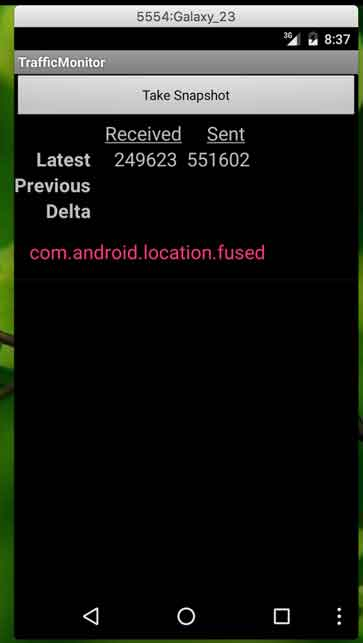
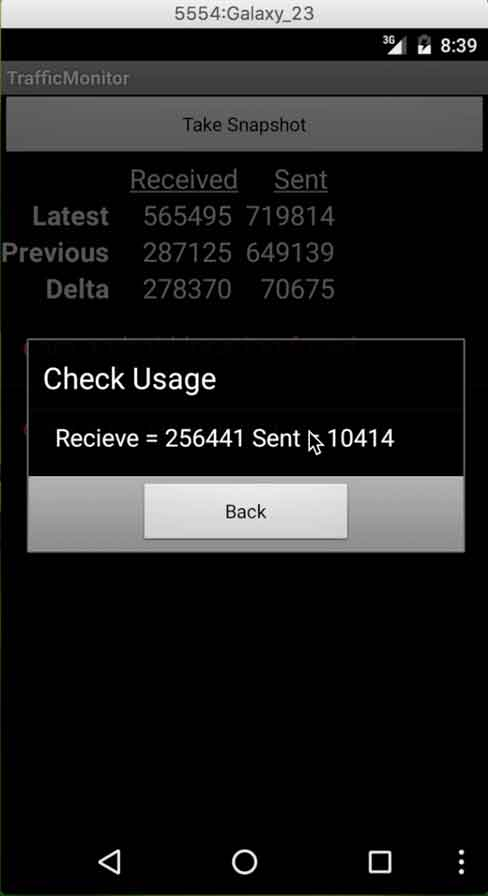
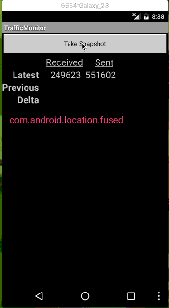
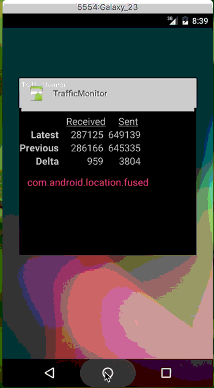

# TrafficMonitor
  This is an Android app that could track the data usage of the phone, basically using the method of "TrafficStats".
  
  
## Functions
###  1. 
  
| Table      | Recieved (Bytes)        | Sent (Bytes)  |
| ------------- |:-------------:| -----:|
| Latest      | Total Bytes recieved at this moment (or after click the button (Take Snapshot)) | ..sent.. |
| Previous      | Total Bytes recieved before click the button (Take Snapshot)      |   ..sent.. |
| Delta | Total Bytes recieved between 2 clicks of the button (Take Snapshot)     |    ..sent.. |

**The Image of the data table**

 
    
    
    
###  2. 
  The ListView under the table shows what apps are using the data currently.
  
  By clicking on the package name of the app, the user could get an alert, showing how many bytes this specific app has recieved and sent. 

**The image of the prompt**

 
    
    
   

### 3. 
  Since "TrafficStats" will be cleared every time of rebooting, I solved this problem by saving all the data in a database using SQLite. 

| ID (row number)      | Previous_rx (bytes)       | Previous_tx (bytes) |  Boot_time |
| ------------- |:-------------:| -----:|-----:|
| 0      | Total bytes recieved (from the beginning of the installation of this app) | ..sent.. | null  |
| 1      | Total bytes recieved (before the latest reboot)  |  ..sent.. | The latest reboot time |

**The image of the database**

## API reference
  TrafficStats: since API level 18

## Code reference
  I had read this code before I made my own solution:
  
  https://github.com/commonsguy/cw-andtuning/tree/master/TrafficMonitor

## Screen shots

**Take Snapshot (refresh the data table and list)**

**When one more app use the data**

